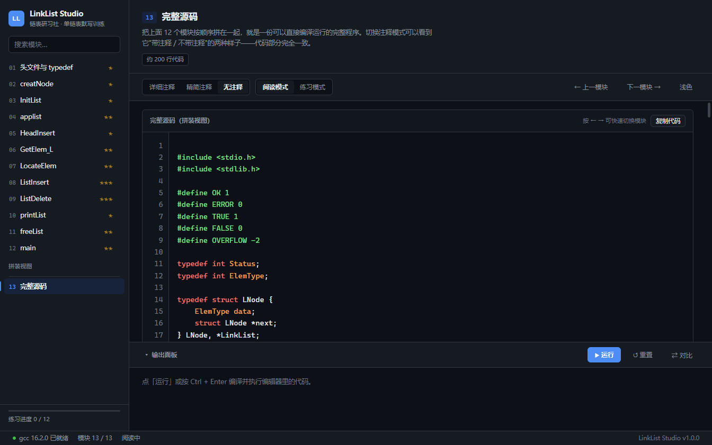
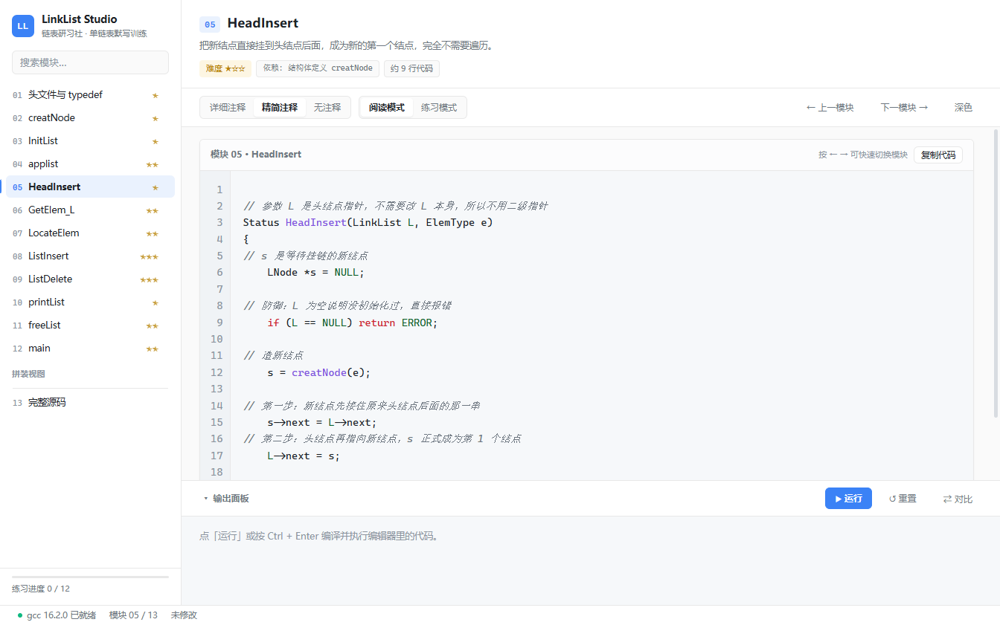
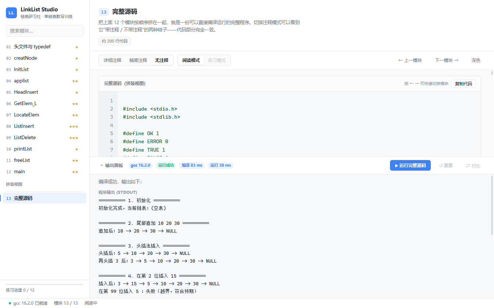
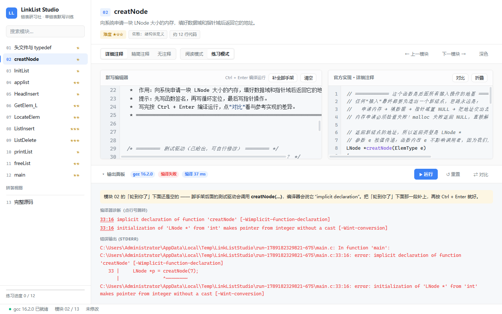
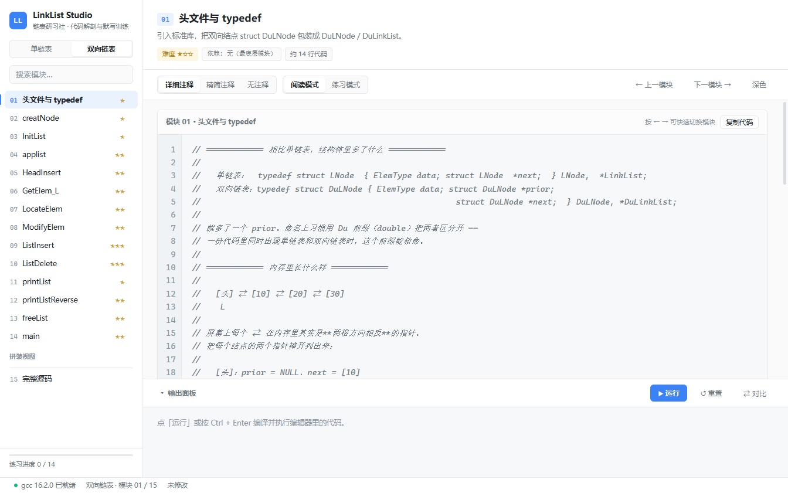
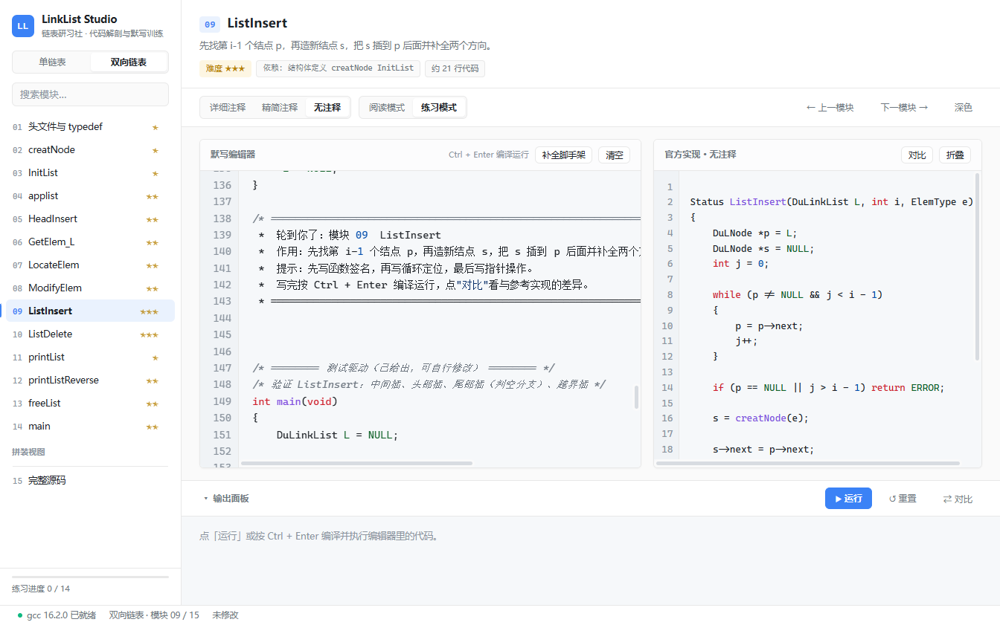
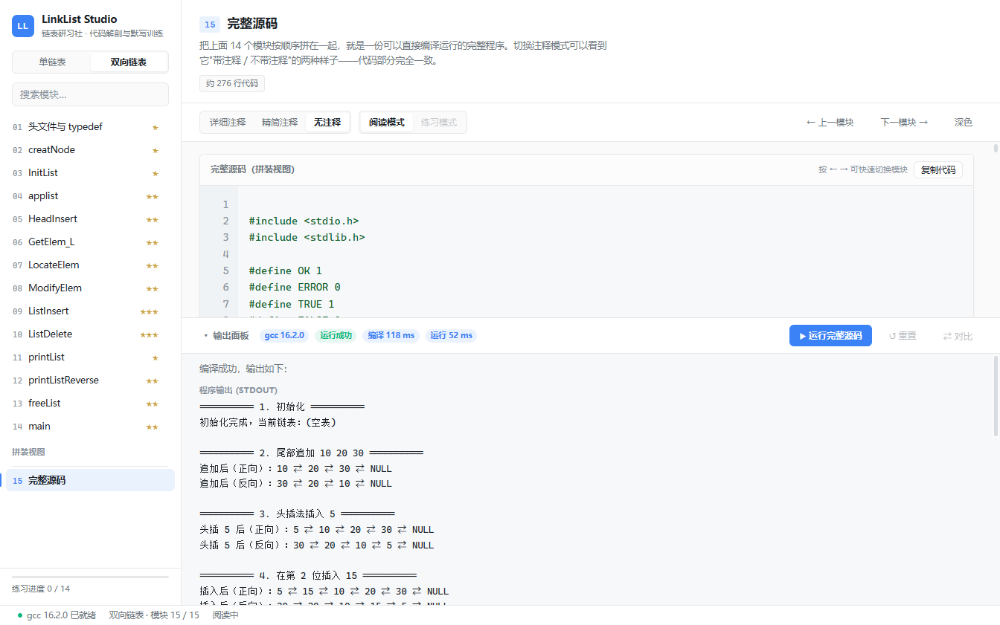

# LinkList Studio（链表研习社）

一个专注**链表代码解剖与默写训练**的极简 Windows 桌面工具。

核心痛点是"识别 ≠ 生成"：能看懂 300 行带头结点的链表 C 代码，却无法独立默写。
本工具用 **分模块阅读 → 去注释裸看 → 空白默写 → 一键编译验证** 的闭环，
把链表的基础积木练成肌肉记忆。

目前内置 **两本互相独立的教材**：

| 教材 | 内容 | 模块数 |
| --- | --- | --- |
| **单链表** | 带头结点 · 类型定义、创建、初始化、尾插、头插、按位/按值查找、按位插入、按位删除、遍历、释放、main、完整源码 | 12 + 完整源码 |
| **双向链表** | 带头结点 · 增删查改齐全：尾插、头插、按位查找、按值查找、**按位修改**、按位插入、按位删除、正向遍历、**反向遍历**、释放、main、完整源码 | 14 + 完整源码 |

两本教材的参考代码、练习草稿、进度、上次看到哪**全部互相隔离** ——
在单链表里练到一半切过去看双向链表，回来时草稿和位置都还在。

---

## 交付物

| 文件 | 说明 |
| --- | --- |
| `dist/LinkList-Studio-1.0.0-portable.exe` | 单文件便携版，双击即用，无需安装 |
| 源码 | 本目录（`electron/` `src/` `shared/` `resources/` `tools/`） |

便携版自带 **内置 TCC 编译器**，所以**目标机器上即使没有装 gcc 也能编译运行**（开箱即用）。

---

## 界面预览

| 阅读模式（详细注释 + ASCII 图示） | 练习模式（编译错误、错误行高亮、点行号跳转） |
| --- | --- |
|  |  |

| 练习模式（填空后一键运行） | 深色主题（完整源码拼装视图） |
| --- | --- |
|  |  |

| 对比（diff 高亮：漏写 / 多写 / 写法不同） | 模块 05 头插法（精简注释） |
| --- | --- |
|  |  |

| 完整源码一键运行（练习模式已置灰） | 还没写就点运行？会有针对性引导 |
| --- | --- |
|  |  |

| 双向链表教材（侧栏可切换） | 双向链表的练习模式 |
| --- | --- |
|  |  |

| 双向链表完整源码一键运行（正反向遍历互相校验） |
| --- |
|  |

---

## 模块演示动画

每个代码模块配一段动画，把**那一句指针赋值到底改变了什么**演出来。
下面的图是**动的**（SVG 内联 SMIL 动画，在 GitHub 上直接播放）：

- 结点里的小圆点是指针域
- **蓝色**是已有的连接，**绿色**是本步新建的结点与连接，**红色**是即将被摘除的结点
- 橙色游标是当前指针（p / q / s），底部同步显示这一步对应的代码

### 单链表

| 04 尾插：走到尾再挂上（O(n)） | 05 头插：不遍历，O(1) |
| --- | --- |
|  |  |

| 08 按位插入：定位前驱 + 两句指针 | 09 按位删除：摘链再 free |
| --- | --- |
|  |  |

### 双向链表

| 09 四指针插入：①③ 指出去、②④ 指回来 | 10 用 p->prior 删除，不必再找前驱 |
| --- | --- |
|  |  |

| 12 反向遍历：单链表做不到的事 | 05 头插必须判空，否则当场崩 |
| --- | --- |
|  |  |

<br>

**全部 26 个模块动画**（单链表 12 个 + 双向链表 14 个）都在 [`docs/animations/`](docs/animations/)，
每个模块一个 `.svg`。想逐个细看可以本地打开 `docs/animations/index.html` ——
那是一个自包含的画廊页，按教材分组，每张卡片都带模块名与一句话说明。

> 动画是声明式生成的：场景定义在 `tools/anim/scenes-*.js`，渲染核心在 `tools/anim/render.js`，
> 跑 `node tools/make-animations.js` 就能重新生成全部动画与画廊；
> `node tools/anim/lint.js` 会体检所有场景（坐标 NaN、动画缺失、时间轴非递增等）。

---

## 功能一览（对照 PRD）

### 3.1 模块化代码阅读器
- 侧栏顶部切换教材（单链表 / 双向链表），下面是该教材的模块树，点击即切换。
- 每个模块顶部显示：模块名 / 一句话作用 / 难度星级 / 依赖模块
  （例如 ListInsert 显示"依赖: 结构体定义 creatNode InitList"）。
- `←` / `→` 键切换上一模块 / 下一模块；`1` `2` `3` 快速切三档注释。

> **关于模块 05「HeadInsert 头插法」**：这是 PRD 之外按需新增的模块，放在 04（尾插法）
> 之后形成正面对照 —— 尾插要遍历到尾部 O(n)，头插直接插在头结点后面 O(1)。
> 因为插在中间会打乱顺序，所以原 05~11 顺延为 06~12，完整源码变为 13。

### 3.2 双重注释模式（关键差异化）
`[详细注释] [精简注释] [无注释]` 三档切换：

- **详细注释**：逐行解释 + ASCII 指针变化图示（例如 ListInsert 的
  "先接后面、再断前面" 两步示意图，以及写反顺序会导致环的说明）。
- **精简注释**：只保留关键步骤，贴近教材风格。
- **无注释**：纯代码骨架，用于默写前观察结构。

> **硬性保证**：三档模式下**函数签名、变量名、缩进、空行逐字节一致**，只剥注释、不动代码。
> 这条不是"注意一下"，而是由 `tools/verify.js` 自动校验的（见下文"自检"）。

### 3.3 内嵌编辑器 + 编译器
- 编辑器带 C 语法高亮（关键字红 / 类型橙 / 函数名紫 / 字符串深蓝 / 数字蓝 / 注释灰斜体 / 宏绿）、
  行号、括号自动配对与配对高亮、Tab 缩进、回车自动缩进。
- 编译器优先调用系统 `gcc`；检测不到时自动启用**内置 TCC**。
- `Ctrl + Enter` 编译运行；输出（含编译错误）显示在底部输出面板。
- 编译错误红色显示，**点行号直接跳到编辑器对应行**，错误行在行号栏标红。
- 右侧可折叠的"官方实现"参照面板；点「对比」做 **diff 高亮**
  （`-` 漏写 / `+` 多写 / `~` 写法不同，并给出统计）。
- 「清空」一键恢复空白默写；「补全脚手架」补回头文件、依赖函数与测试主函数。

> **运行的两种语义**（这点容易混淆，所以明确一下）：
> - **练习模式**下点运行 → 编译运行**编辑器里的代码**（也就是你默写的内容）。
> - **阅读模式**下，模块 13「完整源码」本身就是一份可运行的完整程序，
>   此时按钮会变成「运行完整源码」，点它直接跑屏幕上这份拼装出来的程序
>   （不出错的行会在行号栏标红）。其他模块单独拿出来不是完整程序，所以阅读模式下点运行
>   会自动切到练习模式。
>
> 模块 13 上「练习模式 / 重置 / 对比」会被置灰 —— 拼装视图没有默写练习。

> **关于"还没写就点运行"**：脚手架**故意留空**了你要默写的那一段，而它后面的测试驱动
> 会调用这个函数，所以**填之前编译必然失败**（报 `implicit declaration`）—— 这不是软件坏了。
> 为了不让它看起来像故障：
> - 进入练习模式时，视图会**自动停到「轮到你了」那块空白**上，而不是停在文件末尾的测试驱动；
> - 这时点运行，输出面板顶部会先给出**针对性的说明**（缺哪个函数、为什么必然报错、下一步做什么），
>   并把你送回该写字的地方，而不是丢到测试驱动的报错行上。
>   模块 01（类型定义）和模块 12（`main`）的说法会相应调整，不会硬套同一句话。

### 3.4 主界面布局
左侧模块列表 + 顶部模块信息 + 注释/视图切换 + 代码区 + 输出面板 + 底部状态栏
（`gcc 16.2.0 已就绪 | 模块 07/12 | 已修改`）。

### 四、视觉规范
浅色为默认（背景 `#FAFAFA`、面板 `#FFFFFF`、边框 `#E8E8E8`、强调 `#3B82F6`、代码区 `#F6F8FA`），
深色可切换（`#0D1117` / `#161B22`，语法高亮用 GitHub Dark 配色）。
无渐变、无拟物阴影、无 emoji 堆砌；内容区左右内边距 24px；动效仅 150ms 淡入与 100ms hover。

---

## 练习闭环是怎么跑通的（设计要点）

这是本工具最值得说明的一处设计。

纯函数片段单独编译是跑不起来的（没有 `main`），而"默写一个函数"又必须能立刻验证，
否则闭环断裂。解决办法是**按模块自动生成脚手架**：

1. 扫描该模块的测试驱动，找出它用到的参考函数；
2. 沿调用图做传递闭包（例如驱动用了 `applist`，就自动带出它依赖的 `creatNode`）；
3. 再加上目标模块自己声明的依赖（用户写的 `applist` 会调用 `creatNode`，那就得先给出 `creatNode`）；
4. 已给出的模块放在前面，中间留出**待默写空白**，测试驱动附在最后。

于是「填空 → Ctrl+Enter → 看到运行结果」直接成立。
`tools/verify.js` 会逐一验证每个模块的脚手架**填上答案后确实能编译并运行成功**。

### 双向链表教材的设计要点

它是**独立的一本**，不是单链表的复制粘贴 —— 每个插入删除都在讲"双向"特有的坑：

- **模块 05 HeadInsert**：重点讲空表时 `s->next->prior` 是空指针取成员，
  照抄单链表头插就必崩；
- **模块 09 ListInsert**：四根指针各自的作用（①③ 指出去、②④ 指回来），
  以及为什么②必须判空（插到表尾时）；
- **模块 10 ListDelete**：体现双向链表**真正的价值** —— 单链表删除必须从头找前驱，
  双向链表定位到第 i 个结点后用 `p->prior` 就够了，少一次定位；
- **模块 12 printListReverse**：反向遍历是双向独有的能力，重点讲循环条件
  为什么是 `p != L` 而不是 `p != NULL`（否则会把头结点的垃圾值也打出来）；
- 测试驱动专门覆盖两个最容易崩的分支：**空表头插**和**删尾结点**。

另外双向链表的每个测试驱动都会**同时打印正向和反向** —— 因为漏改 `prior` 的 bug
正向完全看不出来，只有反向遍历才会暴露，两个方向互为校验。

---

## 参考源码的"单一真相来源"

`resources/reference/<教材>/*.c` 既是**可以直接编译运行的 C 程序**，也是三档注释的数据源。
所有训练标记都是合法的 `//` 注释，所以这两种角色不冲突：

```c
//%module | 09 | ListInsert | ListInsert —— 按位插入 | 3 | 01,02,03
//%summary | 先找第 i-1 个结点 p，再造新结点 s，把 s 插到 p 后面并补全两个方向。
//@s 关键步骤注释     → 详细模式 + 精简模式 都显示
//@d 逐行补充 / ASCII 图示 → 只有详细模式显示
    while (p != NULL && j < i - 1)
//%end
```

解析规则（`shared/parse.js`）：

| 模式 | 保留哪些 `//@` 行 |
| --- | --- |
| 详细注释 | `@s` + `@d` |
| 精简注释 | 只有 `@s` |
| 无注释 | 都不保留 |

代码行原样输出 ⇒ 三档模式下的代码逐字节一致。**不需要三份副本，也就不可能写歪。**

---

## 项目结构

```
linklist-studio/
├─ electron/
│  ├─ main.js            主进程：教材加载、编译器检测、编译运行 IPC、持久化
│  └─ preload.js         contextBridge 白名单（界面只能调用这几个能力）
├─ shared/parse.js       参考源码解析器（主进程与自检脚本共用）
├─ src/
│  ├─ index.html         界面骨架
│  ├─ styles.css         视觉规范（浅色/深色变量、语法高亮配色）
│  ├─ theme-boot.js      首帧前定主题，避免深色用户启动闪白屏
│  ├─ highlight.js       C 语法高亮（逐行词法扫描，块注释状态跨行保持）
│  ├─ diff.js            LCS 行级 diff（忽略空行、整行注释、缩进、行内多余空格）
│  ├─ editor.js          编辑器：高亮覆盖层 + 行号 + 括号配对 + 自动缩进
│  └─ app.js             界面主逻辑（教材切换、三档注释、练习闭环）
├─ resources/
│  ├─ reference/
│  │  ├─ singly/*.c      单链表：参考源码 + 各模块测试驱动
│  │  └─ doubly/*.c      双向链表：参考源码 + 各模块测试驱动
│  └─ tcc/               内置 TCC 编译器（含 include / lib / libtcc.dll）
├─ tools/
│  ├─ verify.js          自检脚本（两本教材共 74 项检查）
│  ├─ make-icon.js       生成应用图标（纯 Node，无图形库依赖）
│  └─ png-probe.js       开发辅助：解码 PNG 读真实像素
└─ build/icon.ico        应用图标
```

> 加一本新教材只需要：在 `resources/reference/` 下新建一个目录放参考代码与驱动，
> 然后在 `electron/main.js` 的 `BOOKS` 数组里加一项。界面、草稿隔离、自检都会自动适配。

---

## 自检

```
npm run verify
```

对**每一本教材**分别跑全套检查（共 74 项），覆盖：

1. **解析**：模块的编号/函数名/难度/依赖齐全，行数与预估吻合；
   拼装视图行数合理。
2. **三档一致性**（PRD 3.2 硬性要求）：每个模块在详细/精简/无注释下的**代码行逐字节一致**；
   无注释模式不含任何注释；精简注释始终是详细注释的子集。
3. **完整源码**：无注释版与详细版都能用 gcc 编译、运行，预期输出文本全部命中
   （单链表 16 项、双向链表 25 项）；带 `//@` 训练标记的原始文件本身也是合法 C。
4. **脚手架**：每个模块的脚手架填上答案后**逐个编译并运行成功**；
   被练习的那个模块确实留空、未泄露答案。
5. **内置 TCC**：编译 + 运行 + 输出全部符合预期。

---

## 开发与打包

```powershell
npm install          # 如果 electron 二进制没下下来：cd node_modules/electron && node install.js
npm start            # 开发态运行
npm run verify       # 自检
npm run dist         # 打包成单文件便携 exe（输出到 dist/）
```

---

## 已知限制

- 内置 TCC 是 0.9.27（2017 年版），对 C99 支持不完整；本项目代码只用到它完全支持的部分。
  装了 gcc 的机器会自动优先用 gcc。
- 运行用户程序时有 8 秒超时保护（写成死循环会被强制终止并给出提示），
  防止默写错误导致界面卡死。
- 「对比」在比较时忽略空行、整行注释、缩进与行内多余空格 —— 考的是代码逻辑，不是排版。
- 便携版每次启动会解压到临时目录，首次启动比安装版稍慢。

## 排障开关

| 环境变量 | 作用 |
| --- | --- |
| `LS_FORCE_TCC=1` | 跳过系统 gcc，强制使用内置 TCC。用于在装了 gcc 的机器上复现"没装 gcc"的回退路径。 |
| `LS_CAPTURE=<png 路径>` | 开发用：界面就绪后截图并退出。 |
| `LS_CAPTURE_JS_FILE=<js 路径>` | 开发用：截图前先给页面注入一段脚本，把界面切到指定状态。 |
| `LS_CAPTURE_DELAY=<毫秒>` | 开发用：截图前的等待时间。 |

`LS_CAPTURE` 系列只在设置了 `LS_CAPTURE` 时生效，并同时关闭后台渲染节流；
正常使用不受影响。

