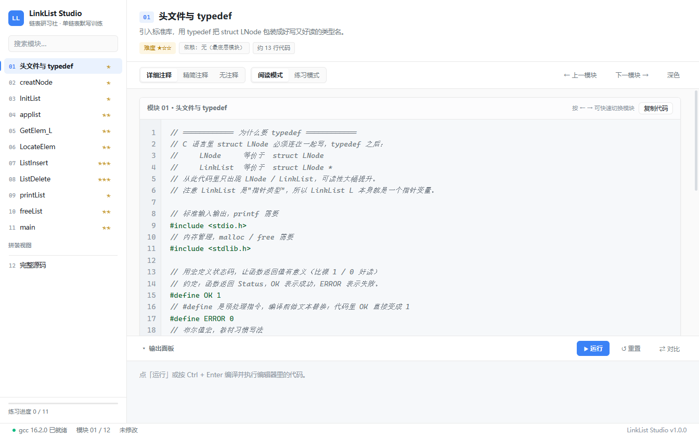
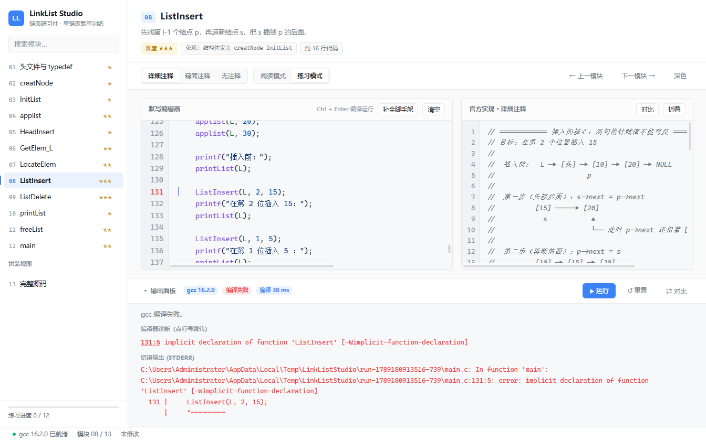
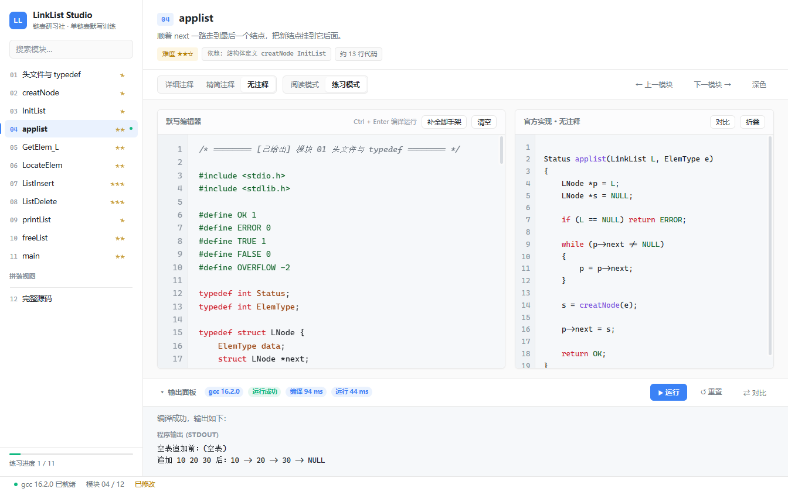
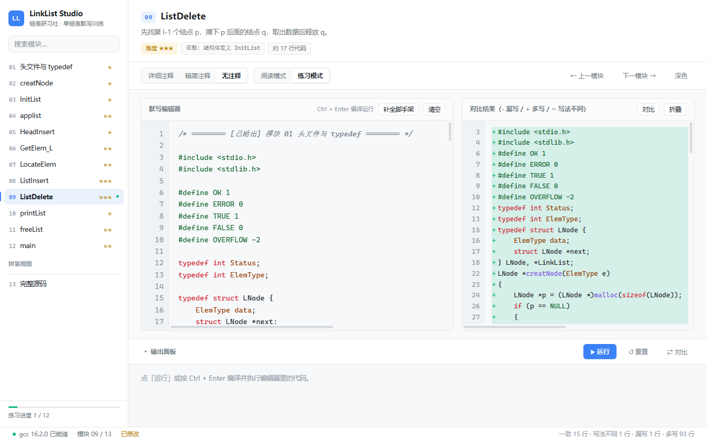

<div align="center">

# 数据结构研习社 · DataStruct Studio

**面向陈越《数据结构》的代码解剖、动画演示与默写训练平台**

看视频 → 打开它 → 分模块读代码 + 看动画 + 空白默写 + 编译验证

[](https://castoricelover777.github.io/datastruct-studio/)
[](https://github.com/castoricelover777/datastruct-studio/releases)

</div>

---

## 它解决什么问题

看懂了 ≠ 写得出来。

数据结构的代码，看懂只要几分钟，合上书自己写却卡在"那句指针到底怎么写"。这个工具把每个模块拆成一条闭环：

**分模块阅读 → 切三档注释裸看 → 空白默写 → 编译验证 → 与官方实现逐行对照**

v1.0 只覆盖链表。v2.0 扩成覆盖课程全部章节的平台——**每换一章不用换工具**。

---

## 在线体验（免安装）

不想装软件？直接在浏览器里打开：

### 👉 **https://castoricelover777.github.io/datastruct-studio/**

**在线版和桌面版共用同一套渲染层。** `tools/build-web.js` 只是把 `src/` 下的页面
原样搬过去，再注入一个用 `fetch` 实现 `window.studio` 的 shim（桌面版这份接口
原本由 preload 走 IPC 提供）。所以不会出现"改了桌面版忘了改网页"，两边行为天然一致：
三层树、三档注释、默写编辑器、逐行 diff、动画播放器、代码联动、草稿（存 localStorage）全都在。

> **一处诚实的差别**：浏览器里没有 C 编译器，在线版**编译不了你的代码**。
> 状态栏会直接显示「Web 版 · 无法编译」，点「运行」也会明说，绝不假装跑过了。
> 想真编译运行，用下面的桌面版——它自带 TCC，没装 gcc 也能跑。

---

## v2.0 新增了什么

| 能力 | 说明 |
| --- | --- |
| **三层导航树** | 章 → 节 → 模块；章可折叠且记忆状态；搜索框输入 `applist` / `AVL` / `BFS` 直接定位；模块右侧有 未学 / 默写中 / 已通过 状态标签 |
| **动画播放器** | 进度条**可拖动**（按下即跳、画面实时跟随）、0.5x～2.0x 变速、**单步**、循环、关键帧圆点（悬停显示步骤名）、空格与 `,` `.` 快捷键 |
| **代码 ↔ 动画联动** | 动画播到哪一句，右侧代码就高亮哪一行并滚进视野；反过来点代码行，动画跳到对应步骤 |
| **链表大模块** | 单链表 / 双链表 / **对比** 三视图。对比视图并排显示同一个操作在两种链表里的写法，双链表多出来的 `prior` 相关行标红 |
| **自定义测试输入** | 编辑区下方「输入」tab，填的内容会喂给程序 stdin（写完即关，不会让 `scanf` 挂住） |
| **数据层完全 JSON 化** | `data/` 目录，按章懒加载，冷启动只读一个很小的 `tree.json` |

---

## 代码与动画联动（最值得看的一处）

动画播放到 `s = creatNode(e);` 这一步时，右侧代码区会自动把源码里对应的那一行高亮并滚动到视野中。

实现上有两个坑，都处理了：

1. 场景里写的是 `while (p->next != NULL)   p = p->next;`，而源码里条件与循环体是分行的——匹配时会退化成「第一个完整子句」（按括号平衡切分）；
2. **三档注释的源码行号完全不同**（详细注释比无注释多出几十行），所以运行时必须按代码内容在当前视图里实时匹配，构建时算好的行号只作兜底。

关键帧到源码行的映射覆盖率：**约 97%**（其余是没有代码片段的纯文字步骤）。

---

## 模块演示动画

每个模块配一段动画，把**那一句关键语句到底改变了什么**演出来。

动画用 SVG 内联 **SMIL** 写成，因此放进 README 用 `` 引用**也能自动播放**；而在桌面版与在线版里，同一份文件被播放器接管，就有了拖动、变速、单步和代码联动——**一套数据，两种消费方式**。

**单链表**

| 04 尾插：走到尾再挂上（O(n)） | 05 头插：不遍历，O(1) |
| --- | --- |
|  |  |

**双链表**

| 09 四指针插入：①③ 指出去、②④ 指回来 | 12 反向遍历：单链表做不到的事 |
| --- | --- |
|  |  |

**顺序表 / 栈 / 队列**（格子阵列类）

| 顺序表插入：搬家必须从后往前 | 循环队列：rear 绕回 0，假溢出被解决 |
| --- | --- |
|  |  |

**算法复杂度**（用执行次数说话）

| O(n²)：n 涨 10 倍，次数涨 100 倍 | 最大子列和：在线处理 O(n) |
| --- | --- |
|  |  |

全部 55 段动画在 [`docs/animations/`](docs/animations/)；也可以打开 [`docs/animations/index.html`](docs/animations/index.html) 看汇总画廊。

---

## 界面预览

| 阅读模式（左动画 / 右代码） | 练习模式（默写 + 官方实现） |
| --- | --- |
|  |  |

| 编译报错定位 | 与官方实现逐行对比 |
| --- | --- |
|  |  |

---

## 内容覆盖

对照陈越《数据结构》课程大纲，**25 节全部完成**（应用内点左下角「模块覆盖清单」也能看到实时版本）：

| 章 | 节 | 模块 · 动画 |
| --- | --- | --- |
| **01 引论** | 01-01 算法复杂度 | ✅ 4 · 4 |
| | 01-02 最大子列和问题（四算法对比 O(n³)→O(n)） | ✅ 5 · 5 |
| **02 线性结构** | 02-01 线性表（顺序表） | ✅ 6 · 6 |
| | **02-02 链表**（单链表 13 + 双链表 15，含对比视图） | ✅ 26 · 26 |
| | 02-03 堆栈 | ✅ 5 · 5 |
| | 02-04 队列（循环队列） | ✅ 5 · 5 |
| | 02-05 应用实例（中缀转后缀 + 求值） | ✅ 4 · 4 |
| **03 树** | 03-01 二叉树基础（四种遍历） | ✅ 9 · 9 |
| | 03-02 二叉搜索树（删除的三种情况） | ✅ 9 · 9 |
| | 03-03 平衡二叉树 AVL（四种旋转） | ✅ 11 · 11 |
| | 03-04 堆（下沉/上浮/O(n) 建堆） | ✅ 9 · 9 |
| | 03-05 哈夫曼树与编码 | ✅ 8 · 8 |
| | 03-06 并查集（路径压缩 + 按大小合并） | ✅ 8 · 8 |
| **04 图** | 04-01 图的表示（邻接矩阵 / 邻接表） | ✅ 7 · 7 |
| | 04-02 图的遍历（DFS / BFS） | ✅ 6 · 6 |
| | 04-03 最短路径（Dijkstra） | ✅ 5 · 5 |
| | 04-04 最小生成树（Prim / Kruskal） | ✅ 6 · 6 |
| | 04-05 拓扑排序（Kahn / DFS 逆后序） | ✅ 5 · 5 |
| **05 排序** | 05-01 冒泡 / 插入 / 希尔 | ✅ 6 · 6 |
| | 05-02 堆排序 / 归并排序 | ✅ 8 · 8 |
| | 05-03 快速排序（三数取中 + 两头夹逼） | ✅ 7 · 7 |
| | 05-04 表排序 / 基数排序 | ✅ 7 · 7 |
| **06 散列** | 06-01 散列函数设计 | ✅ 7 · 7 |
| | 06-02 开放地址法（线性/平方/双散列） | ✅ 8 · 8 |
| | 06-03 分离链接法 | ✅ 7 · 7 |

**25 / 25 节：188 个练习模块、188 段动画、214 个模块（含 26 个拼装视图）。**

全量自检 **10550 项 0 失败**，覆盖：三档注释代码逐字节一致、每个练习模块必须配动画、
预期输出必须由真 gcc 跑出来、关键帧时间递增且不越界、逻辑代码行里不允许出现误用的引号等。

> 每一节都是同一套流程：在 `resources/reference/<节>/` 写标注源码（带 `//%module` / `//%driver` 标记，
> 本身可编译）、在 `resources/animations/` 写动画场景，然后 `npm run data` 重新构建。
> 想加新的章节模板，照 `03-01` 或 `06-01` 的结构写就行。

---

## 数据层：源可编译，应用只读 JSON

PRD 要求数据 JSON 化 + 懒加载，但 v1.0 最值钱的设计是「参考代码本身就是可编译的 C」。两者都保留：

```
resources/course.json          课程大纲（章 → 节 + 章色带 + 完成状态）
resources/reference/<节>/*.c   作者侧源码（带 //%module / //@s / //@d 标记，可直接编译）
resources/animations/<节>.js   动画场景定义
        │
        │  node tools/build-data.js
        ▼
data/tree.json                 章节树（启动只读这一个）
data/chapters/<章>.json        模块元信息（展开章时读）
data/code/<节>.json            三档代码 + 脚手架 + 预期输出（选中节时读）
data/animations/<节>.json      动画关键帧（含 line，供代码联动）
data/coverage.json             覆盖清单
```

**每个模块的「预期输出」是构建时用本机 gcc 真跑出来的**，不是编造的。

### 三档注释怎么保证一致

源码里只有一份代码，注释用两种标记：

- `//@s` 关键步骤注释 → 详细档 + 精简档都显示
- `//@d` 逐行补充 / ASCII 图示 → 只在详细档显示

切档只增删注释行，**代码行逐字节相同**——这一条由自检强制保证（10550 项检查里有专门一项）。

---

## 自检

```bash
npm run verify
```

针对 `data/` 检查（应用只读 data/，检查它才等于检查用户真正会看到的东西）：

- 三档注释的代码部分逐字节一致
- 精简档不比详细档长（说明 `@d` 确实只在详细档）
- 脚手架带「轮到你了」标记、预期输出非空
- 动画关键帧时间递增、不越界、有名字和说明
- SVG 无 `NaN`、含动画元素、不引用外部资源（否则 README 里显示不出来）
- 依赖不悬空、覆盖清单与章节树对得上

**当前：10550 项，0 失败**（含「每个练习模块都必须配动画」这一条）。

---

## 开发

```bash
npm install
npm run data      # 从 resources/ 生成 data/
npm run anim      # 生成动画 SVG + 画廊
npm start         # 启动应用
npm run verify    # 自检
npm run dist      # 打包 Windows 便携版
```

技术栈：Electron 44 + 原生 JS（无框架）+ 自研关键帧动画系统。C 编译优先系统 `gcc`，没有则用内置 TCC 0.9.27。

📖 **不会用？看 [一页纸使用说明](docs/使用说明.md)**（界面布局、动画播放条怎么操作、快捷键、常见问题）。

---

## 交付物

| 文件 | 说明 |
| --- | --- |
| **[DataStruct-Studio-2.1.0-portable.exe](https://github.com/castoricelover777/datastruct-studio/releases/latest)** | 单文件便携版，双击即用，无需安装，**也无需装编译器**（内置 TCC） |
| 在线版 | https://castoricelover777.github.io/datastruct-studio/ |
| 一页纸说明 | [docs/使用说明.md](docs/使用说明.md) |
| 源码 | 本仓库 |

**实测数据**：冷启动 209~223 ms（PRD 要求 < 3s）· 自检 10550 项 0 失败 ·
gcc 与内置 TCC 两条编译路径都验证通过 · 1366×768 不破版。

```
SHA256  BDF6841ECF0F09156C621E9DC67B46420CB5F7DE577DD6C4E5283BBC93D3D9A5
```

---

## 路线

- **v2.0** 架构升级 + 三层树 + 动画播放器 + 代码联动 + 链表大模块 + 01/02 章内容
- **v2.1（本次）** 补齐 03 树 / 04 图 / 05 排序 / 06 散列 —— **陈越课程 25 节全部完成**
- **v2.2** 记忆曲线复习提醒 + 默写计时与打分
- **v3.0** 支持考研 408 大纲、其他老师课程包
